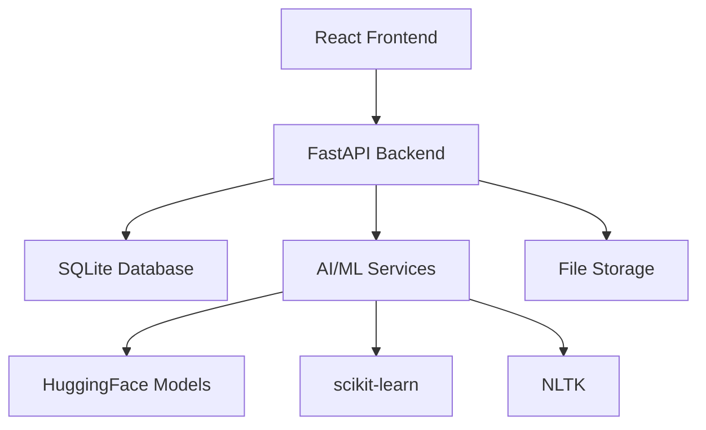

<div align="center">

# 🚀 MultiModule AI System
### Multi-Module AI Automation Platform

[](https://python.org)
[](https://reactjs.org)
[](https://fastapi.tiangolo.com)
[](LICENSE)

*A comprehensive AI-powered productivity platform featuring intelligent document analysis, spam detection, text summarization, and conversational AI.*

[🎮 Quick Start](#-quick-start) • [✨ Features](#-features) • [🛠️ Installation](#️-installation) • [📖 Documentation](#-api-documentation)

</div>

---

## 🎯 Overview

The **AI Productivity Suite** is a full-stack web application that demonstrates real-world AI/ML integration in a production-ready environment. Built for academic demonstration and professional showcasing, it features four distinct AI modules working seamlessly together.

### 🌟 Key Highlights
- **🤖 Real AI Models**: Uses actual transformer models (DistilGPT-2) and ML algorithms
- **🎪 Demo Ready**: No authentication required - instant access to all features
- **🏗️ Production Architecture**: Scalable, maintainable, and cloud-ready design
- **📱 Modern UI**: Responsive React interface with TailwindCSS
- **⚡ Fast Setup**: One-click launcher with `startup.bat`

---

## 🚀 Quick Start

### Option 1: One-Click Launch (Recommended)
```bash
# Simply double-click the startup.bat file
startup.bat
```

### Option 2: Manual Launch
```bash
# Terminal 1 - Backend
cd backend && venv\Scripts\activate && python main.py

# Terminal 2 - Frontend  
cd frontend && npm run dev
```

### 🌐 Access Points
- **Frontend**: http://localhost:5173
- **Backend API**: http://localhost:8000
- **API Documentation**: http://localhost:8000/api/docs

---

## ✨ Features

<table>
<tr>
<td width="50%">

### 📄 Resume Analyzer
- **PDF Processing**: Extract text from resume files
- **NLP Analysis**: Intelligent skill identification
- **Match Scoring**: Compare against job requirements
- **Contact Extraction**: Automatic contact information parsing

</td>
<td width="50%">

### 🛡️ Spam/Phishing Detector
- **ML Classification**: TF-IDF + Logistic Regression
- **Confidence Scoring**: Probability-based results
- **Real-time Analysis**: Instant email/message classification
- **Pattern Recognition**: Advanced threat detection

</td>
</tr>
<tr>
<td width="50%">

### 📝 Text Summarizer
- **Extractive Summarization**: Key sentence identification
- **Bullet Points**: Structured summary output
- **Length Control**: Customizable summary length
- **Context Preservation**: Maintains document meaning

</td>
<td width="50%">

### 🤖 AI Chatbot
- **DistilGPT-2 Model**: Real transformer-based responses
- **Context Awareness**: Maintains conversation history
- **Intent Recognition**: Understands user queries
- **Session Management**: Persistent chat sessions

</td>
</tr>
</table>

### � Analytics Dashboard
- **Usage Statistics**: Track module utilization
- **Performance Metrics**: Monitor system health
- **Activity Timeline**: Historical usage patterns
- **Visual Charts**: Interactive data visualization

---

## 🏗️ Architecture



### Technology Stack

| Layer | Technology | Purpose |
|-------|------------|---------|
| **Frontend** | React 18 + Vite | Modern UI framework with fast development |
| **Styling** | TailwindCSS | Utility-first CSS framework |
| **Backend** | FastAPI | High-performance Python web framework |
| **Database** | SQLite | Lightweight, serverless database |
| **AI/ML** | HuggingFace Transformers | Pre-trained language models |
| **ML Library** | scikit-learn | Machine learning algorithms |
| **NLP** | NLTK | Natural language processing toolkit |

---

## 🛠️ Installation

### Prerequisites
- **Python**: 3.8 or higher
- **Node.js**: 16 or higher
- **Git**: For cloning the repository
- **Windows**: For `startup.bat` (optional)

### Step-by-Step Setup

#### 1️⃣ Clone Repository
```bash
git clone https://github.com/Ramsingh4656/MultiModule-AI-System.git
```

#### 2️⃣ Backend Setup
```bash
cd backend

# Create virtual environment
python -m venv venv

# Activate virtual environment
venv\Scripts\activate  # Windows
# source venv/bin/activate  # Linux/Mac

# Install dependencies
pip install -r requirements.txt
```

#### 3️⃣ Frontend Setup
```bash
cd frontend

# Install Node.js dependencies
npm install
```

#### 4️⃣ Launch Application
```bash
# Use the automated launcher
startup.bat

# OR manually start both servers
# Terminal 1: cd backend && venv\Scripts\activate && python main.py
# Terminal 2: cd frontend && npm run dev
```

---

## 📖 API Documentation

### Core Endpoints

#### Resume Analysis
```http
POST /api/resume/analyze
Content-Type: multipart/form-data

# Upload PDF file with optional required skills
```

#### Spam Detection
```http
POST /api/spam/check
Content-Type: application/json

{
  "text": "Email content to analyze",
  "sender": "sender@example.com"
}
```

#### Text Summarization
```http
POST /api/summary/create
Content-Type: application/json

{
  "text": "Long text to summarize",
  "max_sentences": 3
}
```

#### AI Chatbot
```http
POST /api/chat/message
Content-Type: application/json

{
  "message": "Hello, how are you?",
  "session_id": "optional-session-id"
}
```

### Interactive API Docs
Visit http://localhost:8000/api/docs for complete interactive API documentation with request/response examples.

---

## 🤖 AI Models & Algorithms

### Language Model
- **Model**: DistilGPT-2 (Distilled GPT-2)
- **Provider**: HuggingFace Transformers
- **Purpose**: Conversational AI responses
- **Features**: Context awareness, intent recognition

### Machine Learning
- **Spam Detection**: Logistic Regression with TF-IDF vectorization
- **Text Processing**: NLTK for tokenization and preprocessing
- **Feature Engineering**: Custom NLP pipelines for skill extraction

### Performance
- **Model Loading**: ~10-15 seconds on first startup
- **Response Time**: <2 seconds for most operations
- **Memory Usage**: ~500MB for loaded models

---

## 📁 Project Structure

```
AI-Productivity-Suite/
├── 📁 backend/                 # FastAPI Backend
│   ├── 📄 main.py             # Application entry point
│   ├── 📄 config.py           # Configuration settings
│   ├── 📁 routes/             # API route handlers
│   │   ├── 📄 analytics.py    # Analytics endpoints
│   │   ├── 📄 chatbot.py      # Chatbot endpoints
│   │   ├── 📄 resume.py       # Resume analysis endpoints
│   │   ├── 📄 spam.py         # Spam detection endpoints
│   │   └── 📄 summary.py      # Summarization endpoints
│   ├── 📁 services/           # Business logic layer
│   │   ├── 📄 chatbot_service.py    # AI chatbot service
│   │   ├── 📄 resume_service.py     # Resume analysis service
│   │   ├── 📄 spam_service.py       # Spam detection service
│   │   └── 📄 summary_service.py    # Text summarization service
│   ├── 📁 models/             # Database models
│   ├── 📁 database/           # Database configuration
│   ├── 📁 utils/              # Utility functions
│   └── 📄 requirements.txt    # Python dependencies
├── 📁 frontend/               # React Frontend
│   ├── 📁 src/
│   │   ├── 📁 components/     # Reusable UI components
│   │   ├── 📁 pages/          # Application pages
│   │   ├── 📁 services/       # API communication
│   │   └── 📄 App.jsx         # Main application component
│   ├── 📄 package.json        # Node.js dependencies
│   └── 📄 vite.config.js      # Vite configuration
├── 📄 startup.bat             # One-click launcher
└── 📄 README.md              # This documentation
```

---

## 🎓 Academic & Professional Value

### Learning Outcomes
- **Full-Stack Development**: Complete web application architecture
- **AI/ML Integration**: Real-world machine learning implementation
- **API Design**: RESTful service architecture
- **Modern Frontend**: React with modern tooling
- **Database Design**: Relational data modeling
- **DevOps Practices**: Containerization-ready setup

### Technical Demonstrations
- **Microservices Architecture**: Modular, scalable design
- **Real AI Models**: Not mock data - actual ML predictions
- **Production Patterns**: Error handling, logging, validation
- **Security Considerations**: Input sanitization, CORS configuration
- **Performance Optimization**: Efficient model loading and caching

---

## 🚀 Deployment & Scaling

### Local Development
- SQLite database (included)
- File-based storage
- Single-machine deployment

### Production Considerations
- **Database**: Migrate to PostgreSQL
- **Storage**: Cloud storage (AWS S3, Azure Blob)
- **Caching**: Redis for model caching
- **Load Balancing**: Multiple backend instances
- **Containerization**: Docker support ready

---

## 📊 Performance Metrics

| Operation | Response Time | Resource Usage |
|-----------|---------------|----------------|
| Resume Analysis | 2-5 seconds | 200MB RAM |
| Spam Detection | <1 second | 50MB RAM |
| Text Summarization | 1-3 seconds | 100MB RAM |
| Chatbot Response | 1-2 seconds | 300MB RAM |
| Model Loading | 10-15 seconds | 500MB RAM |

---

### 🌟 Star this repository if you found it helpful!

</div>
